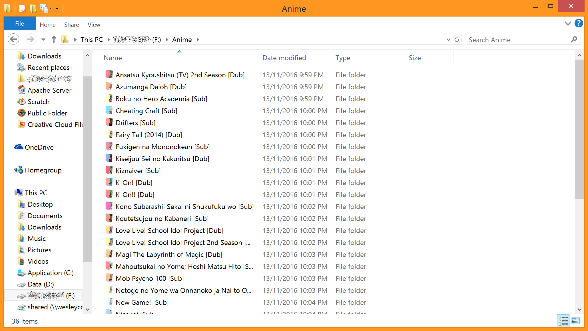

# Folder Icon Generator
*Link coming soon*

## How does it work?
The folder icon generator takes a list of anime (with their titles and image links) and turns them into a zipped file full of icons that you can use to decorate your anime folder.

First, it uses the [Vibrant.js](http://jariz.github.io/vibrant.js/) library to extract the [material design color palette](https://developer.android.com/reference/android/support/v7/graphics/Palette.html) which is used to color the folders. This is all done with javascript in the browser, so it can take some time depending on the client's internet speed.

The next step is sending the image links and colors to the php script. This uses the folder icons (front and back) and the image to make a custom icon. It generates them all as 570 x 570 pixel png files first, then uses the php image to ico library from iThemes to convert all the png files to icons (using the selected sizes). Finally, all the icons are zipped together and the zip file name is posted back to the js script which plops it into the download button.

There are still quite a few bugs in the script (although it took me many hours fixing the async issues with javascript), and there is some error handling that I haven't coded in yet. There is also a function that can import a list of anime from a user's MAL list, but I haven't yet added a gui for that. Also, the script is using an unofficial MAL api that works well at the moment, but may be unstable, and ideally, it would be good to host the api on the same server that has the generator (it's open source).

## Examples
Doesn't it look nice with the colorful icons?

They can really make your folders look nice even if the icons are small!

## Installation for testing
If you want to help me out, clone the repo, and make sure you have php installed with the GD image library. I have 5.6.4, and everything is working fine, so if you have than or anything higher, it should work.

If you manage to find any bugs in my code, please submit a pull request and fix them!

## FAQ
### Why isn't it called "Anime Folder Icon Generator"?
The final goal with this project is to expand it to multiple api's such as imdb, and make it available for not just anime, but any tv show, movie, etc. I didn't want the name to be too specific, although currently it only supports anime.

### Where can I use it?
I don't currently have a server where I can host this yet, or a domain for that matter, so for now you can't. As soon as I can find a place to host it, the link will be available here.

### How can I help?
All the code is open source! If you want to help clean up my messy code, have a great idea, or think that you could make it work better, feel free to submit a pull request and I'll review your changes.

If you don't know any code, or you just want to fix a bug that you found, create a [new issue](https://github.com/GRA0007/Folder-Icon-Generator/issues/new) and let me know what the problem is!